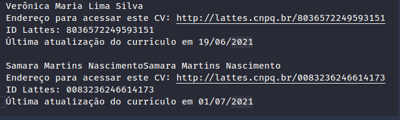

# produtividade_genero

# Passos para a execução do projeto

## git clone https://github.com/CostaPedroHenrique/produtividade_genero
## cd produtividade_genero
## virtualenv --python=python3 venv
## . venv/bin/activate
## pip install -r requirements.txt
## webdrivermanager firefox chrome --linkpath venv/bin
## robot robo.robot

#

# Observações

## * Após pegar as primeiras informações ele fecha o navegador e abre um novo para pegar as próximas informações

## * Existe um delay entre cada passo

## * Os dados coletados são gravados no arquivo result.txt
## Ex.
